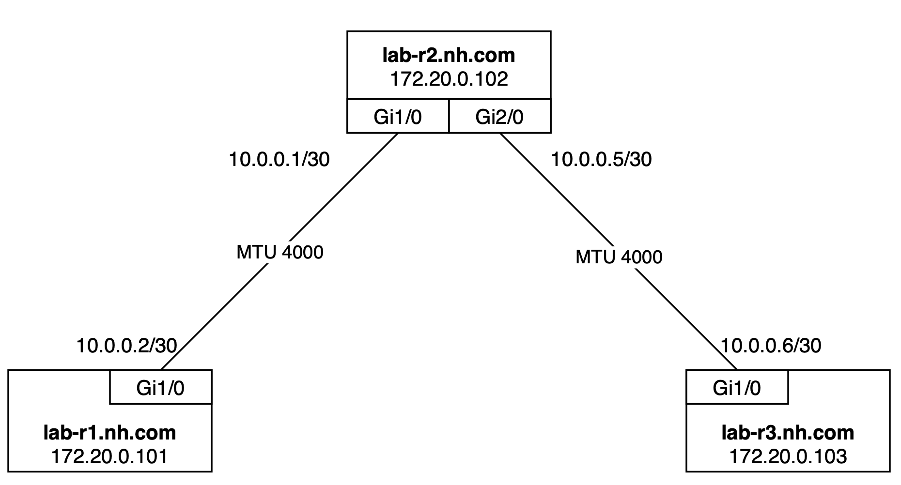
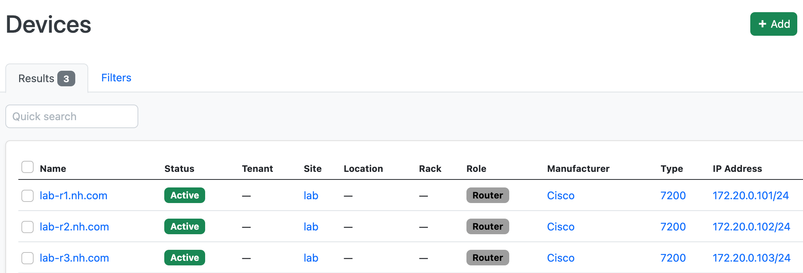
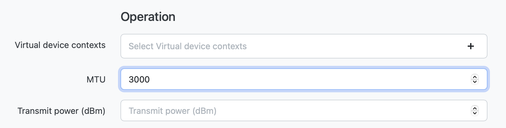

## Basic Scenario. Cisco

### Introduction

In this lab, you will gain hands-on experience in deploying simple network configuration across a network infrastructure. This lab is designed to simulate a real-world scenario:

- MTU configuration
- Description configuration

Author:

- [Vadim Volovik](https://github.com/vadvolo)

### Objectives

- Understand fundamental concepts of Annet


### Topology



### Environment

- Netbox url: http://localhost:8000/
- Netbox login/password: `annet/annet`
- Device telnet and ssh login/password: `annet/annet`
- Device mgmt addresses:
   | Router | MGMT |
   |:------:|:----|
   | lab-r1 | `172.20.0.111` |
   | lab-r2 | `172.20.0.112` |
   | lab-r3 | `172.20.0.113` |

### Preparation

1. Before you start, please put Cisco IOS image `c7200-jk9s-mz.124-13a.bin` into `lab/vm_images` directory.
   The image is subject to a license agreement, so it cannot be distributed in the repository.

2. Install Docker and Docker Compose on your device
   - [Docker](https://docs.docker.com/engine/install/)
     - [Linux](https://docs.docker.com/desktop/install/linux/)
     - [Mac](https://docs.docker.com/desktop/install/mac-install/)
     - [Windows](https://docs.docker.com/desktop/install/windows-install/)

3. Install `make` utility:
   ```bash
   sudo apt install make  # Linux
   brew install make      # MacOS
   ```

### Generators

In this lab, generators are organized within the `./src/lab_generators` directory. The lab utilizes two specific generators:

- Description generator  
  In this generator, we employ a description pattern for device neighbors formatted as `to_<NEIGHBOR_NAME>_<NEIGHBOR_PORT>`. The device connection map is located in Netbox and is utilized by Annet.

- Mtu generator  
  In this generator, we retrieve MTU information for interfaces from Netbox if it has been configured. If no specific MTU setting is provided, we use a default MTU value of 1500.

[Interfaces generator src](./src/lab_generators/interfaces.py)


---
### Lab Guide

**Step 1. Build Annet and Netbox Docker images**

```bash
cd annetutils/contribs/labs
make build
```

**Step 2. Start the lab**

> NOTE: Do not forget to put Cisco IOS image `c7200-jk9s-mz.124-13a.bin` into `lab/vm_images` directory.

```bash
make lab00
```

After this step you will be automatically logged in to annet container as a root. You can login manually by `docker exec -u root -t -i annet /bin/bash`.  
Also 512 bit RSA keys will be generated and SSH enabled. It can take a while. After that annet can log in to device.


**Step 3. Check Netbox**

Check that all devices were imported into [Netbox](http://localhost:8000/dcim/devices/).




**Step 4. Generate configuration for devices**

```bash
annet gen $HOST
```

For example:
```bash
annet gen lab-r1.nh.com
```

You also can put the list of devices:

```bash
annet gen lab-r1.nh.com lab-r2.nh.com lab-r3.nh.com
```

<details>
<summary>Target config for lab-r1</summary>

```
interface FastEthernet0/0
  description disconnected
  mtu 1500
interface FastEthernet0/1
  description disconnected
  mtu 1500
interface GigabitEthernet1/0
  description to_lab-r2.nh.com_GigabitEthernet1/0
  mtu 4000
interface GigabitEthernet2/0
  description disconnected
  mtu 1500
```

</details>

<details>
<summary>Target config for lab-r2</summary>

```
interface FastEthernet0/0
  description disconnected
  mtu 1500
interface FastEthernet0/1
  description disconnected
  mtu 1500
interface GigabitEthernet1/0
  description to_lab-r1.nh.com_GigabitEthernet1/0
  mtu 4000
interface GigabitEthernet2/0
  description to_lab-r3.nh.com_GigabitEthernet1/0
  mtu 4000
```

</details>

<details>
<summary>Target config for lab-r3</summary>

```
interface FastEthernet0/0
  description disconnected
  mtu 1500
interface FastEthernet0/1
  description disconnected
  mtu 1500
interface GigabitEthernet1/0
  description to_lab-r2.nh.com_GigabitEthernet2/0
  mtu 4000
interface GigabitEthernet2/0
  description disconnected
  mtu 1500
```

</details>

**Step 5. Generate diff for devices**

```bash
annet diff $HOST
```

or:

```bash
annet diff lab-r1.nh.com lab-r2.nh.com lab-r3.nh.com
```


<details>
<summary>Diff for lab-r1</summary>

```diff
  interface FastEthernet0/0
+   description disconnected
  interface FastEthernet0/1
+   description disconnected
  interface GigabitEthernet1/0
+   description to_lab-r2.nh.com_GigabitEthernet1/0
+   mtu 4000
  interface GigabitEthernet2/0
+   description disconnected
```

</details>

<details>
<summary>Diff for lab-r2</summary>

```diff
  interface FastEthernet0/0
+   description disconnected
  interface FastEthernet0/1
+   description disconnected
  interface GigabitEthernet1/0
+   description to_lab-r1.nh.com_GigabitEthernet1/0
+   mtu 4000
  interface GigabitEthernet2/0
+   description to_lab-r3.nh.com_GigabitEthernet1/0
+   mtu 4000
```

</details>

<details>
<summary>Diff for lab-r3</summary>

```diff
  interface FastEthernet0/0
+   description disconnected
  interface FastEthernet0/1
+   description disconnected
  interface GigabitEthernet1/0
+   description to_lab-r2.nh.com_GigabitEthernet2/0
+   mtu 4000
  interface GigabitEthernet2/0
+   description disconnected
```

</details>

**Step 6. Generate patch for devices**

```bash
annet patch $HOST
```

or:

```bash
annet patch lab-r1.nh.com lab-r2.nh.com lab-r3.nh.com
```

<details>
<summary>Patch for lab-r1</summary>

```
interface FastEthernet0/0
  description disconnected
  exit
interface FastEthernet0/1
  description disconnected
  exit
interface GigabitEthernet1/0
  description to_lab-r2.nh.com_GigabitEthernet1/0
  mtu 4000
  exit
interface GigabitEthernet2/0
  description disconnected
  exit
```

</details>

<details>
<summary>Patch for lab-r2</summary>

```
interface FastEthernet0/0
  description disconnected
  exit
interface FastEthernet0/1
  description disconnected
  exit
interface GigabitEthernet1/0
  description to_lab-r1.nh.com_GigabitEthernet1/0
  mtu 4000
  exit
interface GigabitEthernet2/0
  description to_lab-r3.nh.com_GigabitEthernet1/0
  mtu 4000
```

</details>

<details>
<summary>Patch for lab-r3</summary>

```
interface FastEthernet0/0
  description disconnected
  exit
interface FastEthernet0/1
  description disconnected
  exit
interface GigabitEthernet1/0
  description to_lab-r2.nh.com_GigabitEthernet2/0
  mtu 4000
  exit
interface GigabitEthernet2/0
  description disconnected
  exit
```

</details>

**Step 7. Deploy configuration to devices**

```bash
annet deploy $HOST
```

or:

```bash
annet deploy --no-ask-deploy lab-r1.nh.com lab-r2.nh.com lab-r3.nh.com
```

**Step 8. Change information in Netbox**

Change the MTU value on [interface](http://localhost:8000/dcim/interfaces/8/) from 4000 to 3000.



Ceckout all commands: `gen`, `diff`, `patch`, `deploy` for lab-r2. You can directly run `deploy --no-ask-deploy` if you are brave enough.

**Step 9. Change generator**

Change the way how description is formed:

```diff
class IfaceDescriptions(PartialGenerator):

- neighbor += f"to_{connection.device.name}_{connection.name}"
+ neighbor += f"to_{connection.device.name}"
```

Ceckout all commands: `gen`, `diff`, `patch`, `deploy` for any router. You also can directly run `deploy`.

**Step 10. After finishing the lab, stop it**

```bash
make services_stop
```
