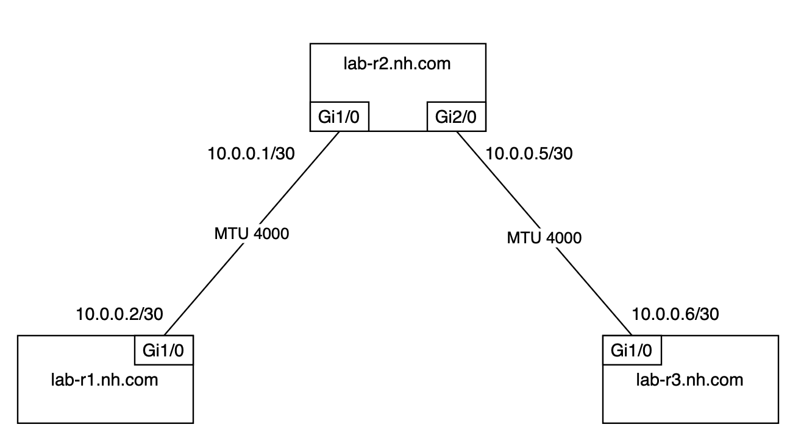

## Basic Scenario. Cisco

### Introduction

In this lab, you will gain hands-on experience in deploying simple network configuration across an network infrastructure. This lab is designed to simulate a real-world scenario:

- mtu configuration
- description configuration

Author:

- [Vadim Volovik](https://github.com/vadvolo)

### Objectives

- Understand the fundamental concepts of Annet

### Topology:



### Preparation

Before you start please put into `../vm_images` Cisco IOS image `c7200-jk9s-mz.124-13a.bin`

### Generators

In this lab, generators are organized within the `./src/lab_generators` directory. The lab utilizes two specific generators:

- Description Generator
- MTU Generator

<details>
<summary>Description Generator</summary>

In this generator, we employ a description pattern for device neighbors formatted as `to_<NEIGHBOR_NAME>_<NEIGHBOR_PORT>`. The device connection map is located in Netbox and is utilized by Annet.

```python
class IfaceDescriptions(PartialGenerator):

    TAGS = ["description"]

    def acl_cisco(self, device):
        return """
        interface
            description
        """

    def run_cisco(self, device):
        for interface in device.interfaces:
            neighbor = ""
            if interface.connected_endpoints:
                for connection in interface.connected_endpoints:
                    neighbor += f"to_{connection.device.name}_{connection.name}"
                with self.block(f"interface {interface.name}"):
                    yield f"description {neighbor}"
            else:
                with self.block(f"interface {interface.name}"):
                    yield f"description disconnected"
```

</details>

<details>
<summary>Mtu Generator</summary>

In this generator, we retrieve the MTU information for interfaces from Netbox if it has been configured. If no specific MTU setting is provided, we use the default MTU value of 1500.

```python
MTU = 1500

class IfaceMtu(PartialGenerator):

    TAGS = ["description"]

    def acl_cisco(self, device):
        return """
        interface
            mtu
        """

    def run_cisco(self, device):
        for interface in device.interfaces:
            if interface.mtu:
                mtu = interface.mtu
            else:
                mtu = MTU
            with self.block(f"interface {interface.name}"):
                yield f"mtu {mtu}"

```

</details>

### Lab Guide

**Step 0.**

First of all, you need to install Docker and Docker Compose softaware on yours device:

- [Docker](https://docs.docker.com/engine/install/)
  - [Linux](https://docs.docker.com/desktop/install/linux/)
  - [Mac](https://docs.docker.com/desktop/install/mac-install/)
  - [Windows](https://docs.docker.com/desktop/install/windows-install/)

**Step 1.**
Build Netbox and Annet docker images:

```bash
cd annetutils/contribs/labs
make build
```

**Step 2.**

NB: Do not forget to put Cisco IOS image `c7200-jk9s-mz.124-13a.bin` into `../vm_images` directory.

Start the lab:

```bash
make lab00
```

**Step 3.**

Check that all devices were imported into Netbox: http://localhost:8000/dcim/devices/ (annet/annet)

**Step 4.**
Go to annet-container

```
docker exec -u root -t -i annet /bin/bash
```

**Step 5.**

Enable SSH on Cisco routers by script:

```
/home/ubuntu/scripts/netsshsetup/netsshsetup -a 172.20.0.100 -v cisco -b ios -l annet -p annet -P telnet --ipdomain nh.com
/home/ubuntu/scripts/netsshsetup/netsshsetup -a 172.20.0.101 -v cisco -b ios -l annet -p annet -P telnet --ipdomain nh.com
/home/ubuntu/scripts/netsshsetup/netsshsetup -a 172.20.0.102 -v cisco -b ios -l annet -p annet -P telnet --ipdomain nh.com
```

**Step 6.**
Generate configuration for lab-r1, lab-r2, lab-r3

| Router |                  Command                   |
| :----: | :----------------------------------------: |
| lab-r1 | `annet gen lab-r1.nh.com` |
| lab-r2 | `annet gen lab-r2.nh.com` |
| lab-r3 | `annet gen lab-r3.nh.com` |

or

```bash
annet gen lab-r1.nh.com lab-r2.nh.com lab-r3.nh.com
```

<details>
<summary>Output for lab-r1:</summary>

```
interface FastEthernet0/0
  description disconnected
  mtu 1500
interface FastEthernet0/1
  description disconnected
  mtu 1500
interface GigabitEthernet1/0
  description to_lab-r2.nh.com_GigabitEthernet1/0
  mtu 4000
interface GigabitEthernet2/0
  description disconnected
  mtu 1500
```

</details>

<details>
<summary>Output for lab-r2:</summary>

```
interface FastEthernet0/0
  description disconnected
  mtu 1500
interface FastEthernet0/1
  description disconnected
  mtu 1500
interface GigabitEthernet1/0
  description to_lab-r1.nh.com_GigabitEthernet1/0
  mtu 4000
interface GigabitEthernet2/0
  description to_lab-r3.nh.com_GigabitEthernet1/0
  mtu 4000
```

</details>

<details>
<summary>Output for lab-r3:</summary>

```
interface FastEthernet0/0
  description disconnected
  mtu 1500
interface FastEthernet0/1
  description disconnected
  mtu 1500
interface GigabitEthernet1/0
  description to_lab-r2.nh.com_GigabitEthernet2/0
  mtu 4000
interface GigabitEthernet2/0
  description disconnected
  mtu 1500
```

</details>

**Step 7.**
Generate diff for lab-r1, lab-r2, lab-r3

| Router |                   Command                   |
| :----: | :-----------------------------------------: |
| lab-r1 | `annet diff lab-r1.nh.com` |
| lab-r2 | `annet diff lab-r2.nh.com` |
| lab-r3 | `annet diff lab-r3.nh.com` |

```bash
annet diff lab-r1.nh.com lab-r2.nh.com lab-r3.nh.com
```


<details>
<summary>Diff for lab-r1:</summary>

```diff
  interface FastEthernet0/0
+   description disconnected
+   mtu 1500
  interface FastEthernet0/1
+   description disconnected
+   mtu 1500
  interface GigabitEthernet1/0
+   description to_lab-r2.nh.com_GigabitEthernet1/0
+   mtu 4000
  interface GigabitEthernet2/0
+   description disconnected
+   mtu 1500
```

</details>

<details>
<summary>Diff for lab-r2:</summary>

```diff
  interface FastEthernet0/0
+   description disconnected
+   mtu 1500
  interface FastEthernet0/1
+   description disconnected
+   mtu 1500
  interface GigabitEthernet1/0
+   description to_lab-r1.nh.com_GigabitEthernet1/0
+   mtu 4000
  interface GigabitEthernet2/0
+   description to_lab-r3.nh.com_GigabitEthernet1/0
+   mtu 4000
```

</details>

<details>
<summary>Diff for lab-r3:</summary>

```diff
  interface FastEthernet0/0
+   description disconnected
+   mtu 1500
  interface FastEthernet0/1
+   description disconnected
+   mtu 1500
  interface GigabitEthernet1/0
+   description to_lab-r2.nh.com_GigabitEthernet2/0
+   mtu 4000
  interface GigabitEthernet2/0
+   description disconnected
+   mtu 1500
```

</details>

**Step 8.**
Generate patch for lab-r1, lab-r2, lab-r3

| Router |                   Command                    |
| :----: | :------------------------------------------: |
| lab-r1 | `annet patch lab-r1.nh.com` |
| lab-r2 | `annet patch lab-r3.nh.com` |
| lab-r3 | `annet patch lab-r3.nh.com` |

```bash
annet patch lab-r1.nh.com lab-r2.nh.com lab-r3.nh.com
```

<details>
<summary>Patch for lab-r1:</summary>

```
interface FastEthernet0/0
  description disconnected
  mtu 1500
  exit
interface FastEthernet0/1
  description disconnected
  mtu 1500
  exit
interface GigabitEthernet1/0
  description to_lab-r2.nh.com_GigabitEthernet1/0
  mtu 4000
  exit
interface GigabitEthernet2/0
  description disconnected
  mtu 1500
  exit
```

</details>

<details>
<summary>Patch for lab-r2:</summary>

```
interface FastEthernet0/0
  description disconnected
  mtu 1500
  exit
interface FastEthernet0/1
  description disconnected
  mtu 1500
  exit
interface GigabitEthernet1/0
  description to_lab-r1.nh.com_GigabitEthernet1/0
  mtu 4000
  exit
interface GigabitEthernet2/0
  description to_lab-r3.nh.com_GigabitEthernet1/0
  mtu 4000
```

</details>

<details>
<summary>Patch for lab-r3:</summary>

```
interface FastEthernet0/0
  description disconnected
  mtu 1500
  exit
interface FastEthernet0/1
  description disconnected
  mtu 1500
  exit
interface GigabitEthernet1/0
  description to_lab-r2.nh.com_GigabitEthernet2/0
  mtu 4000
  exit
interface GigabitEthernet2/0
  description disconnected
  mtu 1500
  exit
```

</details>

**Step 9.**
Deploy configuration into for lab-r1, lab-r2, lab-r3

| Router |                    Command                    |
| :----: | :-------------------------------------------: |
| lab-r1 | `annet deploy lab-r1.nh.com` |
| lab-r2 | `annet deploy lab-r3.nh.com` |
| lab-r3 | `annet deploy lab-r3.nh.com` |

or

```bash
annet patch --no-ask-deploy lab-r1.nh.com lab-r2.nh.com lab-r3.nh.com
```

**Step 10.**
Change the MTU value on [link](http://localhost:8000/dcim/interfaces/8/) from 4000 to 3000.

Repeat process `gen` -> `diff` -> `patch` -> `deploy` for lab-r2.

**Step 11.**
Change the logic generation description

```diff
class IfaceDescriptions(PartialGenerator):

- neighbor += f"to_{connection.device.name}_{connection.name}"
+ neighbor += f"to_{connection.device.name}"
```

Repeat process `gen` -> `diff` -> `patch` -> `deploy` for some router.

**Step 12.**
After finishing the lab, stop it:

```bash
make lab00_stop
```

It is not necessary to stop Netbox and Annet containers, if you plan to continue with other labs.
