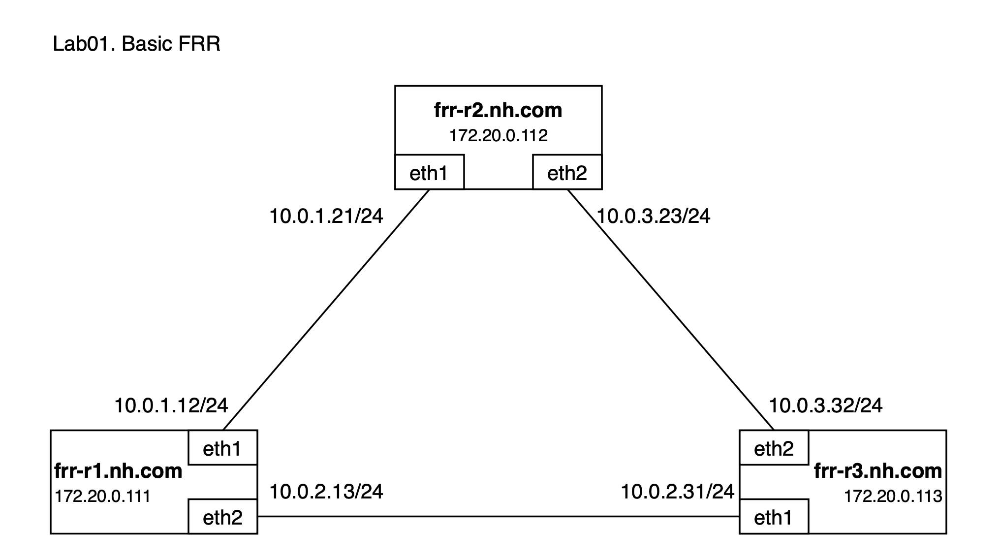
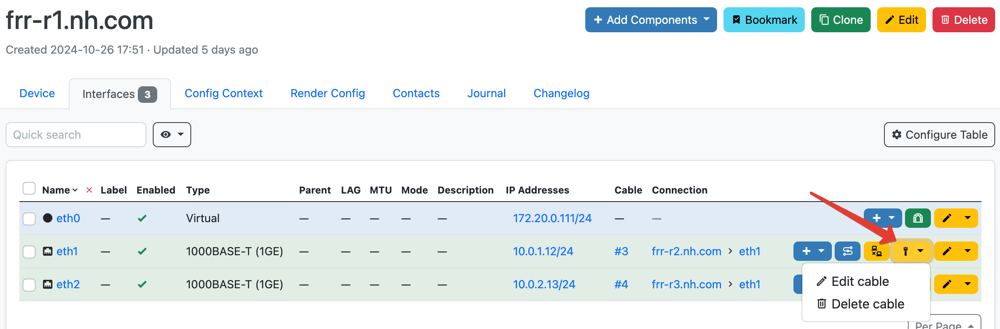
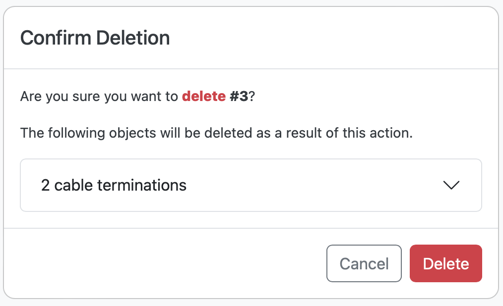
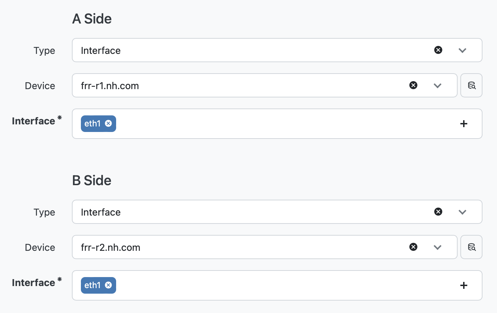

## FRR Base Lab

### Introduction

This lab demonstrates basic principles of network automation using FRR devices. The main goal is demonstrating Annet's `Entire` generator type.

Authors:
- [Grigorii Macheev](https://github.com/gregory-mac),
- [Vadim Volovik](https://github.com/vadvolo),
- [Grigorii Solovev](https://github.com/gs1571)

### Objectives

- Understand main principles of writing Annet `Entire` generators

### Topology



### Environment

- Netbox url: http://localhost:8000/
- Netbox login/password: `annet/annet`
- Device telnet and ssh login/password: `annet/annet`
- Device mgmt addresses:
   | Router | MGMT |
   |:------:|:----|
   | frr-r1 | `172.20.0.111` |
   | frr-r2 | `172.20.0.112` |
   | frr-r3 | `172.20.0.113` |


### Generators

This lab has single generator `./src/lab_generators/frr.py`.


Unlike the `Partial` generators from the previous lab, which create and apply configuration line-by-line, the `Entire` type generates a whole configuration file in one go, which is then copied to the device. [More about Entire generators in annet documentation](https://annetutil.github.io/annet/main/usage/gen.html#entire).  
FRR can be managed by `vtysh`, a Cisco-like CLI shell, but it also stores its configuration in a `/etc/frr/frr.conf` file.
We can leverage this fact to manage the routing configuration in a server-like manner, and `Partial` generator will help us to prepare the configuration file.

The generator in this example configures interface descriptions, IP addresses and BGP sessions between FRR routers.
All the parameters are defined by connections in Netbox.

- [frr generator src](./src/lab_generators/f.py)

---

### Lab Guide

**Step 1. If it was not done yet, build Netbox and Annet docker images**

```bash
cd annetutils/contribs/labs
make build
```

**Step 2. Start the lab**

```bash
make lab01
```

> NOTE: On Linux, `make` uses root privileges to execute the following command which is required to clear operational configs if they exist:
> ```bash
> $(SUDO) find operational_configs -mindepth 1 -not -name '.gitkeep' -delete || true && \
> ```

**Step 3. Generate configuration for devices**

`annet gen frr-r1.nh.com frr-r2.nh.com frr-r3.nh.com`

<details>
<summary>Output</summary>

```
# -------------------- frr-r1.nh.com.cfg/etc/frr/frr.conf --------------------
frr defaults datacenter
service integrated-vtysh-config

hostname frr-r1
log file /var/log/frr/frr.log

interface eth0
 ip address 172.20.0.111/24
exit

interface eth1
 ip address 10.0.1.12/24
exit

interface eth2
 description frr-r3.nh.com@eth1
 ip address 10.0.2.13/24
exit

router bgp 65001
 bgp router-id 172.20.0.111
 neighbor 10.0.2.31 remote-as 65001
 neighbor 10.0.2.31 interface eth2

line vty
# -------------------- frr-r2.nh.com.cfg/etc/frr/frr.conf --------------------
frr defaults datacenter
service integrated-vtysh-config

hostname frr-r2
log file /var/log/frr/frr.log

interface eth0
 ip address 172.20.0.112/24
exit

interface eth1
 ip address 10.0.1.21/24
exit

interface eth2
 description frr-r3.nh.com@eth2
 ip address 10.0.3.23/24
exit

router bgp 65001
 bgp router-id 172.20.0.112
 neighbor 10.0.3.32 remote-as 65001
 neighbor 10.0.3.32 interface eth2

line vty
# -------------------- frr-r3.nh.com.cfg/etc/frr/frr.conf --------------------
frr defaults datacenter
service integrated-vtysh-config

hostname frr-r3
log file /var/log/frr/frr.log

interface eth0
 ip address 172.20.0.113/24
exit

interface eth1
 description frr-r1.nh.com@eth2
 ip address 10.0.2.31/24
exit

interface eth2
 description frr-r2.nh.com@eth2
 ip address 10.0.3.32/24
exit

router bgp 65001
 bgp router-id 172.20.0.113
 neighbor 10.0.2.13 remote-as 65001
 neighbor 10.0.2.13 interface eth1
 neighbor 10.0.3.23 remote-as 65001
 neighbor 10.0.3.23 interface eth2

line vty
```

</details>

Look at diff:

`annet diff frr-r1.nh.com frr-r2.nh.com frr-r3.nh.com`

<details>
<summary>Output</summary>

```diff
# -------------------- frr-r1.nh.com/etc/frr/frr.conf --------------------
---
+++
@@ -8,4 +8,21 @@
  ip address 172.20.0.111/24
 exit

+interface eth1
+ description frr-r2.nh.com@eth1
+ ip address 10.0.1.12/24
+exit
+
+interface eth2
+ description frr-r3.nh.com@eth1
+ ip address 10.0.2.13/24
+exit
+
+router bgp 65001
+ bgp router-id 172.20.0.111
+ neighbor 10.0.1.21 remote-as 65001
+ neighbor 10.0.1.21 interface eth1
+ neighbor 10.0.2.31 remote-as 65001
+ neighbor 10.0.2.31 interface eth2
+
 line vty
# -------------------- frr-r2.nh.com/etc/frr/frr.conf --------------------
---
+++
@@ -8,4 +8,21 @@
  ip address 172.20.0.112/24
 exit

+interface eth1
+ description frr-r1.nh.com@eth1
+ ip address 10.0.1.21/24
+exit
+
+interface eth2
+ description frr-r3.nh.com@eth2
+ ip address 10.0.3.23/24
+exit
+
+router bgp 65001
+ bgp router-id 172.20.0.112
+ neighbor 10.0.1.12 remote-as 65001
+ neighbor 10.0.1.12 interface eth1
+ neighbor 10.0.3.32 remote-as 65001
+ neighbor 10.0.3.32 interface eth2
+
 line vty
# -------------------- frr-r3.nh.com/etc/frr/frr.conf --------------------
---
+++
@@ -8,4 +8,21 @@
  ip address 172.20.0.113/24
 exit

+interface eth1
+ description frr-r1.nh.com@eth2
+ ip address 10.0.2.31/24
+exit
+
+interface eth2
+ description frr-r2.nh.com@eth2
+ ip address 10.0.3.32/24
+exit
+
+router bgp 65001
+ bgp router-id 172.20.0.113
+ neighbor 10.0.2.13 remote-as 65001
+ neighbor 10.0.2.13 interface eth1
+ neighbor 10.0.3.23 remote-as 65001
+ neighbor 10.0.3.23 interface eth2
+
 line vty
```

</details>

**Step 4. Deploy it**

`annet deploy frr-r1.nh.com frr-r2.nh.com frr-r3.nh.com`

You can check the BGP Peers:
- `ssh annet@172.20.0.111 "echo "show ip bgp summary" | sudo vtysh"`
- `ssh annet@172.20.0.112 "echo "show ip bgp summary" | sudo vtysh"`
- `ssh annet@172.20.0.113 "echo "show ip bgp summary" | sudo vtysh"`

**Step 5. Remove connection in Netbox and deploy configs**

Remove [connection](http://localhost:8000/dcim/devices/5/interfaces/) between `frr-r1` and `frr-r2` in Netbox.





Look at diff:

`annet diff frr-r1.nh.com frr-r2.nh.com frr-r3.nh.com`

<details>
<summary>Output</summary>

```diff
# -------------------- frr-r1.nh.com/etc/frr/frr.conf --------------------
---
+++
@@ -9,7 +9,6 @@
 exit

 interface eth1
- description frr-r2.nh.com@eth1
  ip address 10.0.1.12/24
 exit

@@ -20,8 +19,6 @@

 router bgp 65001
  bgp router-id 172.20.0.111
- neighbor 10.0.1.21 remote-as 65001
- neighbor 10.0.1.21 interface eth1
  neighbor 10.0.2.31 remote-as 65001
  neighbor 10.0.2.31 interface eth2

# -------------------- frr-r2.nh.com/etc/frr/frr.conf --------------------
---
+++
@@ -9,7 +9,6 @@
 exit

 interface eth1
- description frr-r1.nh.com@eth1
  ip address 10.0.1.21/24
 exit

@@ -20,8 +19,6 @@

 router bgp 65001
  bgp router-id 172.20.0.112
- neighbor 10.0.1.12 remote-as 65001
- neighbor 10.0.1.12 interface eth1
  neighbor 10.0.3.32 remote-as 65001
  neighbor 10.0.3.32 interface eth2
```

</details>

**Deploy it:**

`annet deploy frr-r1.nh.com frr-r2.nh.com`

You can check the BGP Peers:
- `ssh annet@172.20.0.111 "echo "show ip bgp summary" | sudo vtysh"`
- `ssh annet@172.20.0.112 "echo "show ip bgp summary" | sudo vtysh"`

**Step 6. Restore connection in Netbox and deploy configs**

Restore [connection](http://localhost:8000/dcim/cables/add/?a_terminations_type=dcim.interface&a_terminations=17&b_terminations_type=dcim.interface&termination_b_site=1&termination_b_rack=&return_url=/dcim/devices/5/interfaces/) between `frr-r1` and `frr-r2` in Netbox.



Look at diff:

`annet diff frr-r1.nh.com frr-r2.nh.com frr-r3.nh.com`

<details>
<summary>Output</summary>

```diff
# -------------------- frr-r1.nh.com/etc/frr/frr.conf --------------------
---
+++
@@ -9,6 +9,7 @@
 exit

 interface eth1
+ description frr-r2.nh.com@eth1
  ip address 10.0.1.12/24
 exit

@@ -19,6 +20,8 @@

 router bgp 65001
  bgp router-id 172.20.0.111
+ neighbor 10.0.1.21 remote-as 65001
+ neighbor 10.0.1.21 interface eth1
  neighbor 10.0.2.31 remote-as 65001
  neighbor 10.0.2.31 interface eth2

# -------------------- frr-r2.nh.com/etc/frr/frr.conf --------------------
---
+++
@@ -9,6 +9,7 @@
 exit

 interface eth1
+ description frr-r1.nh.com@eth1
  ip address 10.0.1.21/24
 exit

@@ -19,6 +20,8 @@

 router bgp 65001
  bgp router-id 172.20.0.112
+ neighbor 10.0.1.12 remote-as 65001
+ neighbor 10.0.1.12 interface eth1
  neighbor 10.0.3.32 remote-as 65001
  neighbor 10.0.3.32 interface eth2

```

</details>

**Deploy it:**

`annet deploy frr-r1.nh.com frr-r2.nh.com`

You can check the BGP Peers:
- `ssh annet@172.20.0.111 "echo "show ip bgp summary" | sudo vtysh"`
- `ssh annet@172.20.0.112 "echo "show ip bgp summary" | sudo vtysh"`

**Step 7. After finishing the lab, stop it**

```bash
make services_stop
```

