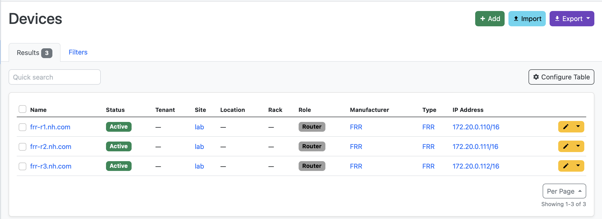

## FRR Base Lab

### Introduction

This lab demonstrates basic principles of network automation using FRR devices. The main goal is demonstrating Annet's `Entire` generator type.

Authors:
- [Grigorii Macheev](https://github.com/gregory-mac),
- [Vadim Volovik](https://github.com/vadvolo),
- [Grigorii Solovev](https://github.com/gs1571)

### Objectives

- Understand main principles of writing Annet `Entire` generators

### Topology


### Generators

Unlike the `Partial` generators from the previous lab, which create and apply configuration line-by-line, the `Entire` type generates a whole configuration file in one go, which is then copied to the device.
FRR can be managed by `vtysh`, a Cisco-like CLI shell, but it also stores its configuration in a `/etc/frr/frr.conf` file.
We can leverage this fact to manage the routing configuration in a server-like manner, and `Partial` generator will help us to prepare the configuration file.

The generator in this example configures interface descriptions, IP addresses and BGP sessions between FRR routers.
All the parameters are defined by connections in Netbox.

### Lab Guide

| Router | MGMT |
|:------:|:----|
| frr-r1 | `172.20.0.110` |
| frr-r2 | `172.20.0.111` |
| frr-r3 | `172.20.0.112` |



**Step 1.**
If it was not done in one of the previous labs, build Netbox and Annet docker images:

```bash
cd annetutils/contribs/labs
make build
```

**Step 2.**

Start the lab:

```bash
make lab01
```

**Step 3.**

Go to the Annet container:

```bash
docker exec -u root -t -i annet /bin/bash
```

Generate configuration for `frr-r1`, `frr-r2`, `frr-r3`:

`annet gen frr-r1.nh.com frr-r2.nh.com frr-r3.nh.com`

Look at diff:

`annet diff frr-r1.nh.com frr-r2.nh.com frr-r3.nh.com`

Deploy it:

`annet deploy frr-r1.nh.com frr-r2.nh.com frr-r3.nh.com`

**Step 4.**

Remove [connection](http://localhost:8000/dcim/devices/5/interfaces/) between `frr-r1` and `frr-r2` in Netbox.


Look at diff:

`annet diff frr-r1.nh.com frr-r2.nh.com frr-r3.nh.com`

Deploy it:

`annet deploy frr-r1.nh.com frr-r2.nh.com frr-r3.nh.com`

**Step 5.**

Restore [connection](http://localhost:8000/dcim/cables/add/?a_terminations_type=dcim.interface&a_terminations=17&b_terminations_type=dcim.interface&termination_b_site=1&termination_b_rack=&return_url=/dcim/devices/5/interfaces/) between `frr-r1` and `frr-r2` in Netbox.


Look at diff:

`annet diff frr-r1.nh.com frr-r2.nh.com frr-r3.nh.com`

Deploy it:

`annet deploy frr-r1.nh.com frr-r2.nh.com frr-r3.nh.com`

**Step 6.**

Switch off the lab: `make services_stop`
