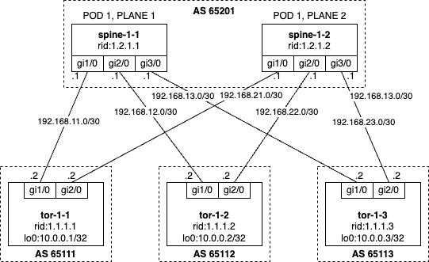

# Cisco DC Lab

### Introduction

This lab shows us example of DC networks. During the lab you do:

- deploy whole configuration on ToRs and Spines
- change role one of the tor to unknown role and deploy configuration on the tor and every spine
- set maintenance tag on one of the spines and deploy configuration on the spine

Author:

- [Grigorii Solovev](https://github.com/gs1571)

### Objectives

- Understand main principals of writing annet generators

## Preparation

Before you start please put into `../vm_images` Cisco IOS image `c7200-jk9s-mz.124-13a.bin`

## Topology



Naming:

- Spine - `spine-<pod>-<plane>`
- ToR - `tor-<pod>-<num>`
- Router ID Spine - `1.2.<pod>.<plane>`
- Router ID ToR - `1.1.<pod>.<num>`
- ASNUM Spine - `6520<pod>`
- ASNUM ToR - `6510<pod><num>`

### Generators

In this lab, generators are organized within the `./src/lab_generators` directory. The lab utilizes two specific generators:

- Hostname
- Interface IP addresses, descriptions and shutdown
- Route map
- BGP process

Important notice, BGP attrs generates by mesh model. Mesh models allow assign attrs to devices follow the connections between them.

#### Hostname

The default configuration has basic names like a `tor` or `spine`, the generator set hostname to the names are taken from Netbox.

[src](./src/lab_generators/hostname.py)

#### Interface descriptions

Follow the connections in Netbox descriptions on the interfaces are created as `remote_hostname@remote_port`.

[src](./src/lab_generators/description.py)

#### Interface shutdown

The generator set `no shutdown` to every interfaces on the device.

[src](./src/lab_generators/description.py)

#### Interface IP addresses

The lab has two kind of IP addresses:

1. IP addresses know from Netbox
2. IP addresses on links between ToR and Spines which generated by mesh model.

The generator collected two kind of addresses and assign them to interfaces.

- [generator src](./src/lab_generators/ip_address.py]
- [mesh spine src](./src/lab_generators/mesh_views/spine.py]
- [mesh tor src](./src/lab_generators/mesh_views/tor.py]


#### Route map

For the BGP neighbors and redistribute connected route-maps are needed, they should be generated before BGP process. Some interesting thing is checking tag `maintenance` on Spine and apply drain traffic logic there. The role is also important for the generator.

[src](./src/lab_generators/rpl.py)

#### BGP process

BGP neighbors also depend on connections in Netbox, they generated only if connection presents. There is supported by mesh model.

- [generator src](./src/lab_generators/bgp.py]
- [mesh spine src](./src/lab_generators/mesh_views/spine.py]
- [mesh tor src](./src/lab_generators/mesh_views/tor.py]

### Lab Guide

**Step 1.**
If it was not done in one of the previous labs, build Netbox and Annet docker images:

```bash
cd annetutils/labs
make build
```

and start them:

```bash
make services_start
```

**Step 2.**

NB: Do not forget to put Cisco IOS image `c7200-jk9s-mz.124-13a.bin` into `../vm_images` directory.

Start the lab:

```bash
make lab03_start
```

**Step 3.**

Go to annet-container

```
docker exec -u root -t -i annet /bin/bash
```

Enable SSH on Cisco routers by script:

```
for ip in 0 1 2 3 4; do netsshsetup -a 172.20.0.10$ip -b ios -l annet -p annet -P telnet -v cisco --ipdomain nh.com; done
```

**Step 4.**

Go to annet-container

```
docker exec -u root -t -i annet /bin/bash
```

Generate configuration for spine-1-1, spine-1-2, tor-1-1, tor-1-2, tor-1-3

`annet gen spine-1-1.nh.com spine-1-2.nh.com tor-1-1.nh.com tor-1-2.nh.com tor-1-3.nh.com`

Look at diff

`annet diff spine-1-1.nh.com spine-1-2.nh.com tor-1-1.nh.com tor-1-2.nh.com tor-1-3.nh.com`

Deploy it

`annet deploy spine-1-1.nh.com spine-1-2.nh.com tor-1-1.nh.com tor-1-2.nh.com tor-1-3.nh.com`

**Step 5.**

Assign "Unknown" role to one of the ToR's and deploy configuration on the ToR and every Spine.

Go to the [Netbox](http://localhost:8000/), use annet:annet as login:password. Assign tor-1-1.nh.com role "Unknown".

Look at diff

`annet diff spine-1-1.nh.com spine-1-2.nh.com tor-1-1.nh.com tor-1-2.nh.com tor-1-3.nh.com`

Deploy it

`annet deploy spine-1-1.nh.com spine-1-2.nh.com tor-1-1.nh.com tor-1-2.nh.com tor-1-3.nh.com`

Restore the role and repeat the actions.

**Step 6.**

Break a connection and check what happening.

Go to the [Netbox](http://localhost:8000/), use annet:annet as login:password. Delete connection between tor-1-1.nh.com and spine-1-1.nh.com.

Look at diff

`annet diff spine-1-1.nh.com spine-1-2.nh.com tor-1-1.nh.com tor-1-2.nh.com tor-1-3.nh.com`

Deploy it

`annet deploy spine-1-1.nh.com spine-1-2.nh.com tor-1-1.nh.com tor-1-2.nh.com tor-1-3.nh.com`

Restore the connection and repeat the actions.

**Step 7.**

Drain traffic from on of the Spine.

Go to the [Netbox](http://localhost:8000/), use annet:annet as login:password. Assign spine-1-1.nh.com tag "maintenance".

Look at diff

`annet diff spine-1-1.nh.com spine-1-2.nh.com tor-1-1.nh.com tor-1-2.nh.com tor-1-3.nh.com`

Deploy it

`annet deploy spine-1-1.nh.com spine-1-2.nh.com tor-1-1.nh.com tor-1-2.nh.com tor-1-3.nh.com`

Remove the tag and repeat the actions.

**Step 8.**

After finishing the lab, stop it:

```bash
make lab03_stop
```

And stop Netbox and Annet containers:

```bash
make services_stop
```
