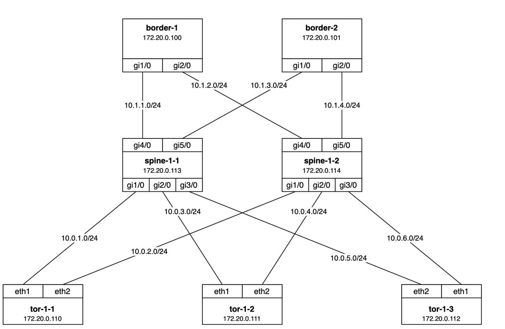

## Lab03. Multivendor lab

### Introduction

In this lab we will see how Annet manages software from several different vendors:

- Arista
- FRR
- Cisco

Author:

### Objectives

- To try out Annet in a multivendor environment

### Preparation

#### How to get Arista image

1. Go to https://www.arista.com/en/login
2. Log in or register at Arista.com
3. Go to https://www.arista.com/en/support/software-download
4. Download the `cEOS64-lab-4.33.0F.tar.xz`
5. Prepare docker image: `docker image import cEOS64-lab-4.33.0F.tar.xz arista-ceos:4.33.0F`

Now you're able to run Lab03.

### Topology



### Lab Guide

**Step 1.** Run the lab:

```bash
make lab03
```

```
for ip in 0 1; do netsshsetup -a 172.20.0.10$ip -b ios -l annet -p annet -P telnet -v cisco --ipdomain nh.com; done
```