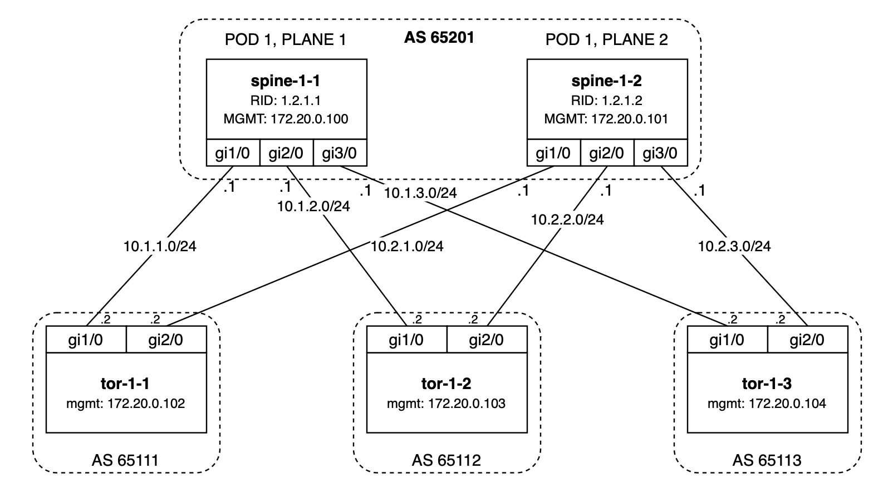

## Cisco DC Lab

### Introduction

This lab shows an example of DC networks built on Cisco. During the lab you will:

- Deploy the whole configuration on ToRs and spines
- Break connection between Spine and ToR and deploy configuration on the switches
- Set maintenance tag on one of the spines to drain traffic and deploy configuration

Author:

- [Grigorii Solovev](https://github.com/gs1571)

### Objectives

- Understand main principles of writing Annet generators and mesh

### Preparation

Before you start, please put Cisco IOS image `c7200-jk9s-mz.124-13a.bin` into `lab/vm_images` directory.
The image is subject to a license agreement, so it cannot be distributed in the repository.

### Topology



**Naming:**

- Spine — `spine-<pod>-<plane>`
- ToR — `tor-<pod>-<num>`
- Router ID spine — `1.2.<pod>.<plane>`
- Router ID ToR — `1.1.<pod>.<num>`
- ASNUM spine — `6520<pod>`
- ASNUM ToR — `6510<pod><num>`

### Environment

- Netbox url: http://localhost:8000/
- Netbox login/password: `annet/annet`
- Device telnet and ssh login/password: `annet/annet`  
- Device mgmt addresses:
   | Router | MGMT |
   |:------:|:----|
   | spine-1-1 | `172.20.0.101` |
   | spine-1-2 | `172.20.0.102` |
   | tor-1-1 | `172.20.0.103` |
   | tor-1-2 | `172.20.0.104` |
   | tor-1-3 | `172.20.0.105` |

### Mesh

BGP attributes are generated by mesh. Mesh allows assigning attributes to devices, following the connections between them (in Netbox).  
[More about mesh in annet documentation](https://annetutil.github.io/annet/main/mesh/index.html).

### Generators

In this lab, generators are organized within the `./src/lab_generators` directory. The lab utilizes the following generators:

- Hostname
- Interface IP addresses, descriptions and shutdown state
- Route map
- BGP process


#### Hostname generator

The default configuration has basic names like `tor` or `spine`. The generator sets these names to hostnames taken from Netbox.

- [Hostname generator src](./src/lab_generators/hostname.py)

#### Interface descriptions generator

Following the connections in Netbox, the descriptions on the interfaces are created as `remote_hostname@remote_port`.

- [Interface descriptions generator src](./src/lab_generators/description.py)

#### Interface shutdown generator

The generator sets `no shutdown` to every interface on the device.

- [Interface shutdown generator src](./src/lab_generators/shutdown.py)

#### Interface IP addresses generator

The lab has two kinds of IP addresses:

1. IP addresses known from Netbox
2. IP addresses on links between ToRs and spines which are generated by the mesh model

The generator collects the two kinds of addresses and assigns them to the interfaces.

- [generator src](./src/lab_generators/ip_address.py)
- [mesh spine src](./src/lab_generators/mesh_views/spine.py)
- [mesh tor src](./src/lab_generators/mesh_views/tor.py)

#### Route map generator

For BGP, neighbors and `redistribute connected` route-maps are needed, which should be generated before BGP process. An interesting thing to do is to apply `maintenance` tag on a spine, and then drain traffic there. The role is also important for the generator.

- [Route map generator src](./src/lab_generators/rpl.py)

#### BGP process

BGP neighbors also depend on the connections in Netbox, they are generated only if a connection is present. This is supported by the mesh models.

- [generator src](./src/lab_generators/bgp.py)
- [mesh spine src](./src/lab_generators/mesh_views/spine.py)
- [mesh tor src](./src/lab_generators/mesh_views/tor.py)

---

### Lab Guide

**Step 1. Build Annet and Netbox Docker images**

If it was not done yet, build Netbox and Annet docker images:

```bash
cd annetutils/contribs/labs
make build
```

**Step 2. Start the lab**

> NOTE: Do not forget to put Cisco IOS image `c7200-jk9s-mz.124-13a.bin` into `../vm_images` directory.

```bash
make lab10
```

After this step you will be automatically logged in to annet container as a root. You can login manually by `docker exec -u root -t -i annet /bin/bash`.

**Step 3. Deploy configuration to devices**

Generate configuration for spine-1-1, spine-1-2, tor-1-1, tor-1-2, tor-1-3:

```bash
annet gen spine-1-1.nh.com spine-1-2.nh.com tor-1-1.nh.com tor-1-2.nh.com tor-1-3.nh.com
```

<details>
<summary>Example of spine target configuration</summary>

```
hostname spine-1-1
ip bgp-community new-format
ip community-list standard GSHUT permit 65535:0
ip community-list standard TOR_NETS permit 65000:1
interface GigabitEthernet1/0
  no shutdown
  ip address 10.1.1.11 255.255.255.0
  description tor-1-1@Gi1/0
interface GigabitEthernet2/0
  no shutdown
  ip address 10.1.2.11 255.255.255.0
  description tor-1-2@Gi1/0
interface GigabitEthernet3/0
  no shutdown
  ip address 10.1.3.11 255.255.255.0
  description tor-1-3@Gi1/0
interface FastEthernet0/0
  no shutdown
  ip address 172.20.0.100 255.255.255.0
interface FastEthernet0/1
  no shutdown
route-map SPINE_IMPORT_TOR permit 10
  match community TOR_NETS
route-map SPINE_IMPORT_TOR deny 9999
route-map SPINE_EXPORT_TOR permit 10
  match community TOR_NETS
route-map SPINE_EXPORT_TOR deny 9999
router bgp 65201
  bgp router-id 1.2.1.1
  bgp log-neighbor-changes
  neighbor TOR peer-group
  neighbor TOR route-map SPINE_IMPORT_TOR in
  neighbor TOR route-map SPINE_EXPORT_TOR out
  neighbor TOR soft-reconfiguration inbound
  neighbor TOR send-community both
  neighbor 10.1.1.12 remote-as 65111
  neighbor 10.1.2.12 remote-as 65112
  neighbor 10.1.3.12 remote-as 65113
  neighbor 10.1.1.12 peer-group TOR
  neighbor 10.1.2.12 peer-group TOR
  neighbor 10.1.3.12 peer-group TOR
```

</details>

<details>
<summary>Example of tor target configuration</summary>

```
hostname tor-1-1
ip bgp-community new-format
ip community-list standard GSHUT permit 65535:0
ip community-list standard TOR_NETS permit 65000:1
interface GigabitEthernet1/0
  no shutdown
  ip address 10.1.1.12 255.255.255.0
  description spine-1-1@Gi1/0
interface GigabitEthernet2/0
  no shutdown
  ip address 10.2.1.12 255.255.255.0
  description spine-1-2@Gi1/0
interface FastEthernet0/0
  no shutdown
  ip address 172.20.0.102 255.255.255.0
interface Loopback0
  no shutdown
  ip address 10.0.0.1 255.255.255.255
interface FastEthernet0/1
  no shutdown
interface GigabitEthernet3/0
  no shutdown
route-map TOR_IMPORT_SPINE permit 10
  match community GSHUT
  set local-preference 0
route-map TOR_IMPORT_SPINE permit 20
  set local-preference 100
route-map TOR_EXPORT_SPINE permit 10
  match community TOR_NETS
route-map TOR_EXPORT_SPINE deny 9999
route-map IMPORT_CONNECTED permit 10
  match interface Loopback0
  set community 65000:1
route-map IMPORT_CONNECTED deny 9999
router bgp 65111
  bgp router-id 1.1.1.1
  bgp log-neighbor-changes
  maximum-paths 16
  redistribute connected route-map IMPORT_CONNECTED
  neighbor SPINE peer-group
  neighbor SPINE route-map TOR_IMPORT_SPINE in
  neighbor SPINE route-map TOR_EXPORT_SPINE out
  neighbor SPINE soft-reconfiguration inbound
  neighbor SPINE send-community both
  neighbor 10.1.1.11 remote-as 65201
  neighbor 10.2.1.11 remote-as 65201
  neighbor 10.1.1.11 peer-group SPINE
  neighbor 10.2.1.11 peer-group SPINE
```

</details>

Look at diff:
```bash
annet diff spine-1-1.nh.com spine-1-2.nh.com tor-1-1.nh.com tor-1-2.nh.com tor-1-3.nh.com
```

<details>
<summary>Example of spine diff</summary>

```diff
+ hostname spine-1-1
- hostname spine
+ ip bgp-community new-format
+ route-map SPINE_IMPORT_TOR permit 10
+   match community TOR_NETS
+ route-map SPINE_IMPORT_TOR deny 9999
+ route-map SPINE_EXPORT_TOR permit 10
+   match community TOR_NETS
+ route-map SPINE_EXPORT_TOR deny 9999
+ ip community-list standard GSHUT permit 65535:0
+ ip community-list standard TOR_NETS permit 65000:1
+ router bgp 65201
+   bgp router-id 1.2.1.1
+   bgp log-neighbor-changes
+   neighbor TOR peer-group
+   neighbor TOR route-map SPINE_IMPORT_TOR in
+   neighbor TOR route-map SPINE_EXPORT_TOR out
+   neighbor TOR soft-reconfiguration inbound
+   neighbor TOR send-community both
+   neighbor 10.1.1.12 remote-as 65111
+   neighbor 10.1.2.12 remote-as 65112
+   neighbor 10.1.3.12 remote-as 65113
+   neighbor 10.1.1.12 peer-group TOR
+   neighbor 10.1.2.12 peer-group TOR
+   neighbor 10.1.3.12 peer-group TOR
  interface GigabitEthernet1/0
-   shutdown
+   ip address 10.1.1.11 255.255.255.0
+   description tor-1-1@Gi1/0
  interface GigabitEthernet2/0
-   shutdown
+   ip address 10.1.2.11 255.255.255.0
+   description tor-1-2@Gi1/0
  interface GigabitEthernet3/0
-   shutdown
+   ip address 10.1.3.11 255.255.255.0
+   description tor-1-3@Gi1/0
  interface FastEthernet0/1
-   shutdown
```

</details>

<details>
<summary>Example of tor diff</summary>

```diff
+ hostname tor-1-1
- hostname tor
+ ip bgp-community new-format
+ interface Loopback0
+   no shutdown
+   ip address 10.0.0.1 255.255.255.255
+ route-map TOR_IMPORT_SPINE permit 10
+   match community GSHUT
+   set local-preference 0
+ route-map TOR_IMPORT_SPINE permit 20
+   set local-preference 100
+ route-map TOR_EXPORT_SPINE permit 10
+   match community TOR_NETS
+ route-map TOR_EXPORT_SPINE deny 9999
+ route-map IMPORT_CONNECTED permit 10
+   match interface Loopback0
+   set community 65000:1
+ route-map IMPORT_CONNECTED deny 9999
+ ip community-list standard GSHUT permit 65535:0
+ ip community-list standard TOR_NETS permit 65000:1
+ router bgp 65111
+   bgp router-id 1.1.1.1
+   bgp log-neighbor-changes
+   maximum-paths 16
+   redistribute connected route-map IMPORT_CONNECTED
+   neighbor SPINE peer-group
+   neighbor SPINE route-map TOR_IMPORT_SPINE in
+   neighbor SPINE route-map TOR_EXPORT_SPINE out
+   neighbor SPINE soft-reconfiguration inbound
+   neighbor SPINE send-community both
+   neighbor 10.1.1.11 remote-as 65201
+   neighbor 10.2.1.11 remote-as 65201
+   neighbor 10.1.1.11 peer-group SPINE
+   neighbor 10.2.1.11 peer-group SPINE
  interface GigabitEthernet1/0
-   shutdown
+   ip address 10.1.1.12 255.255.255.0
+   description spine-1-1@Gi1/0
  interface GigabitEthernet2/0
-   shutdown
+   ip address 10.2.1.12 255.255.255.0
+   description spine-1-2@Gi1/0
  interface FastEthernet0/1
-   shutdown
  interface GigabitEthernet3/0
-   shutdown
```

</details>

Look at patch:

`annet patch spine-1-1.nh.com spine-1-2.nh.com tor-1-1.nh.com tor-1-2.nh.com tor-1-3.nh.com`


<details>
<summary>Example of spine patch</summary>

```
no hostname spine
hostname spine-1-1
ip community-list standard GSHUT permit 65535:0
ip community-list standard TOR_NETS permit 65000:1
ip bgp-community new-format
interface GigabitEthernet1/0
  no shutdown
  ip address 10.1.1.11 255.255.255.0
  description tor-1-1@Gi1/0
  exit
interface GigabitEthernet2/0
  no shutdown
  ip address 10.1.2.11 255.255.255.0
  description tor-1-2@Gi1/0
  exit
interface GigabitEthernet3/0
  no shutdown
  ip address 10.1.3.11 255.255.255.0
  description tor-1-3@Gi1/0
  exit
interface FastEthernet0/1
  no shutdown
  exit
route-map SPINE_IMPORT_TOR permit 10
  match community TOR_NETS
  exit
route-map SPINE_IMPORT_TOR deny 9999
route-map SPINE_EXPORT_TOR permit 10
  match community TOR_NETS
  exit
route-map SPINE_EXPORT_TOR deny 9999
router bgp 65201
  bgp router-id 1.2.1.1
  bgp log-neighbor-changes
  neighbor TOR peer-group
  neighbor TOR route-map SPINE_IMPORT_TOR in
  neighbor TOR route-map SPINE_EXPORT_TOR out
  neighbor TOR soft-reconfiguration inbound
  neighbor TOR send-community both
  neighbor 10.1.1.12 remote-as 65111
  neighbor 10.1.2.12 remote-as 65112
  neighbor 10.1.3.12 remote-as 65113
  neighbor 10.1.1.12 peer-group TOR
  neighbor 10.1.2.12 peer-group TOR
  neighbor 10.1.3.12 peer-group TOR
  exit
```

</details>

<details>
<summary>Example of tor patch</summary>

```
no hostname tor
hostname tor-1-1
ip community-list standard GSHUT permit 65535:0
ip community-list standard TOR_NETS permit 65000:1
ip bgp-community new-format
interface GigabitEthernet1/0
  no shutdown
  ip address 10.1.1.12 255.255.255.0
  description spine-1-1@Gi1/0
  exit
interface GigabitEthernet2/0
  no shutdown
  ip address 10.2.1.12 255.255.255.0
  description spine-1-2@Gi1/0
  exit
interface FastEthernet0/1
  no shutdown
  exit
interface GigabitEthernet3/0
  no shutdown
  exit
interface Loopback0
  ip address 10.0.0.1 255.255.255.255
  no shutdown
  exit
route-map TOR_IMPORT_SPINE permit 10
  match community GSHUT
  set local-preference 0
  exit
route-map TOR_IMPORT_SPINE permit 20
  set local-preference 100
  exit
route-map TOR_EXPORT_SPINE permit 10
  match community TOR_NETS
  exit
route-map TOR_EXPORT_SPINE deny 9999
route-map IMPORT_CONNECTED permit 10
  match interface Loopback0
  set community 65000:1
  exit
route-map IMPORT_CONNECTED deny 9999
router bgp 65111
  bgp router-id 1.1.1.1
  bgp log-neighbor-changes
  maximum-paths 16
  redistribute connected route-map IMPORT_CONNECTED
  neighbor SPINE peer-group
  neighbor SPINE route-map TOR_IMPORT_SPINE in
  neighbor SPINE route-map TOR_EXPORT_SPINE out
  neighbor SPINE soft-reconfiguration inbound
  neighbor SPINE send-community both
  neighbor 10.1.1.11 remote-as 65201
  neighbor 10.2.1.11 remote-as 65201
  neighbor 10.1.1.11 peer-group SPINE
  neighbor 10.2.1.11 peer-group SPINE
  exit
```

</details>

Deploy it:
```bash
annet deploy spine-1-1.nh.com spine-1-2.nh.com tor-1-1.nh.com tor-1-2.nh.com tor-1-3.nh.com
```

**Step 4.** Break a connection and check what happens**

Go to [Netbox](http://localhost:8000/dcim/devices/7/), delete the connection between `tor-1-1.nh.com` and `spine-1-1.nh.com`.

Look at diff:
```bash
annet diff spine-1-1.nh.com spine-1-2.nh.com tor-1-1.nh.com tor-1-2.nh.com tor-1-3.nh.com
```

<details>
<summary>spine-1-1 diff</summary>

```diff
  router bgp 65201
-   neighbor 10.1.1.12 remote-as 65111
-   neighbor 10.1.1.12 peer-group TOR
  interface GigabitEthernet1/0
-   description tor-1-1@Gi1/0
-   ip address 10.1.1.11 255.255.255.0
```

</details>

<details>
<summary>tor-1-1 diff</summary>

```diff
  router bgp 65111
-   neighbor 10.1.1.11 remote-as 65201
-   neighbor 10.1.1.11 peer-group SPINE
  interface GigabitEthernet1/0
-   description spine-1-1@Gi1/0
-   ip address 10.1.1.12 255.255.255.0
```

</details>

Look at patch:

`annet patch spine-1-1.nh.com spine-1-2.nh.com tor-1-1.nh.com tor-1-2.nh.com tor-1-3.nh.com`

<details>
<summary>spine-1-1 patch</summary>

```diff
interface GigabitEthernet1/0
no description
no ip address 10.1.1.11 255.255.255.0
exit
router bgp 65201
no neighbor 10.1.1.12 peer-group TOR
no neighbor 10.1.1.12 remote-as 65111
exit
```

</details>

<details>
<summary>tor-1-1 patch</summary>

```
interface GigabitEthernet1/0
no description
no ip address 10.1.1.12 255.255.255.0
exit
router bgp 65111
no neighbor 10.1.1.11 peer-group SPINE
no neighbor 10.1.1.11 remote-as 65201
exit
```

</details>

Deploy it:
```bash
annet deploy spine-1-1.nh.com spine-1-2.nh.com tor-1-1.nh.com tor-1-2.nh.com tor-1-3.nh.com
```

**Step 5. Restore the connection and repeat the actions**

**Step 6. Drain traffic from one of the spines**

Go to [Netbox](http://localhost:8000/dcim/devices/5/), assign `spine-1-1.nh.com` tag `maintenance`.

Look at diff:
```bash
annet diff spine-1-1.nh.com spine-1-2.nh.com tor-1-1.nh.com tor-1-2.nh.com tor-1-3.nh.com
```

<details>
<summary>spine-1-1 diff</summary>

```diff
  route-map SPINE_EXPORT_TOR permit 10
+   set community 65535:0 additive
```

</details>

Look at patch:

`annet patch spine-1-1.nh.com spine-1-2.nh.com tor-1-1.nh.com tor-1-2.nh.com tor-1-3.nh.com`

<details>
<summary>spine-1-1 patch</summary>

```
route-map SPINE_EXPORT_TOR permit 10
  set community 65535:0 additive
  exit
```

</details>

Deploy it:
```bash
annet deploy spine-1-1.nh.com spine-1-2.nh.com tor-1-1.nh.com tor-1-2.nh.com tor-1-3.nh.com
```

Unfortunately Cisco IOS does not apply policies on changes. It is required to readvertise BGP routes manually by executing `clear ip bgp * soft`.

Remove the tag and repeat the actions.

**Step 7. After finishing the lab, stop it**

```bash
make services_stop
```
