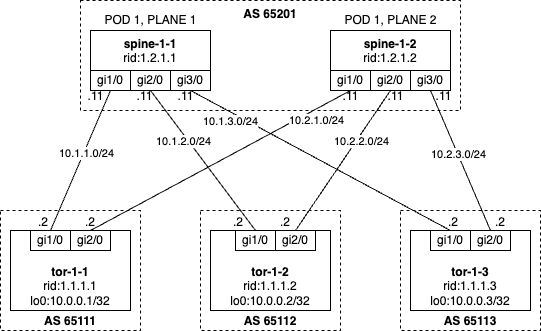

## Frrouting DC Lab

### Introduction

This lab shows an example of DC networks built on FRR. During the lab you will:

- Deploy the whole configuration on ToRs and spines
- Break connection between Spine and ToR and deploy configuration on the switches
- Set maintenance tag on one of the spines to drain traffic and deploy configuration

Author:

- [Grigorii Solovev](https://github.com/gs1571)

### Objectives

- Understand main principles of writing Annet generators and mesh

### Topology



**Naming:**

- Spine — `spine-<pod>-<plane>`
- ToR — `tor-<pod>-<num>`
- Router ID spine — `1.2.<pod>.<plane>`
- Router ID ToR — `1.1.<pod>.<num>`
- ASNUM spine — `6520<pod>`
- ASNUM ToR — `6510<pod><num>`

### Environment

- Netbox url: http://localhost:8000/
- Netbox login/password: `annet/annet`
- Device telnet and ssh login/password: `annet/annet`  
- Device mgmt addresses:
   | Router | MGMT |
   |:------:|:----|
   | spine-1-1 | `172.20.0.101` |
   | spine-1-2 | `172.20.0.102` |
   | tor-1-1 | `172.20.0.103` |
   | tor-1-2 | `172.20.0.104` |
   | tor-1-3 | `172.20.0.105` |

### Mesh

BGP attributes are generated by mesh. Mesh allows assigning attributes to devices, following the connections between them (in Netbox).  
[More about mesh in annet documentation](https://annetutil.github.io/annet/main/mesh/index.html).

### Generator

In this lab, generators are organized within the `./src/lab_generators` directory. Since FRR is configured through entire generator the lab has just one generator.

The generator sets:
- some minor frr configuration lines
- hostname
- descriptions snd ip addresses to interfaces
- bgp general configurations
- bgp peers
- route-map and community lists

The lab has two kinds of IP addresses:

1. IP addresses known from Netbox
2. IP addresses on links between ToRs and spines which are generated by the mesh model

The generator collects the two kinds of addresses and assigns them to the interfaces.

For BGP, neighbors and `redistribute connected` route-maps are needed, which should be generated before BGP process. An interesting thing to do is to apply `maintenance` tag on a spine, and then drain traffic there. The role is also important for the generator.

BGP neighbors also depend on the connections in Netbox, they are generated only if a connection is present. This is supported by the mesh models.

- [FRR entire generator](./src/lab_generators/entire_frr.py)

### Lab Guide

**Step 1. Build Annet and Netbox Docker images**

If it was not done yet, build Netbox and Annet docker images:

```bash
cd annetutils/contribs/labs
make build
```

**Step 2. Start the lab**

```bash
make lab11
```

After this step you will be automatically logged in to annet container as a root. You can login manually by `docker exec -u root -t -i annet /bin/bash`.

**Step 3. Deploy configuration to devices**

Generate configuration for spine-1-1, spine-1-2, tor-1-1, tor-1-2, tor-1-3:

```bash
annet gen spine-1-1.nh.com spine-1-2.nh.com tor-1-1.nh.com tor-1-2.nh.com tor-1-3.nh.com
```

<details>
<summary>Example of spine target configuration</summary>

```
frr defaults datacenter
service integrated-vtysh-config

hostname spine-1-1
log file /var/log/frr/frr.log

interface eth0
 ip address 172.20.0.111/24
exit

interface eth1
 description tor-1-1.nh.com@eth1
 ip address 10.1.1.11/24
exit

interface eth2
 description tor-1-2.nh.com@eth1
 ip address 10.1.2.11/24
exit

interface eth3
 description tor-1-3.nh.com@eth1
 ip address 10.1.3.11/24
exit

router bgp 65201
 bgp router-id 1.2.1.1
 neighbor TOR peer-group
 neighbor 10.1.1.12 remote-as 65111
 neighbor 10.1.1.12 peer-group TOR
 neighbor 10.1.2.12 remote-as 65112
 neighbor 10.1.2.12 peer-group TOR
 neighbor 10.1.3.12 remote-as 65113
 neighbor 10.1.3.12 peer-group TOR
 address-family ipv4 unicast
  neighbor TOR route-map SPINE_IMPORT_TOR in
  neighbor TOR route-map SPINE_EXPORT_TOR out
 exit-address-family
exit

bgp community-list standard TOR_NETS seq 5 permit 65000:1
bgp community-list standard GSHUT seq 5 permit graceful-shutdown

route-map SPINE_IMPORT_TOR permit 10
 match community TOR_NETS
exit

route-map SPINE_IMPORT_TOR deny 9999
exit


route-map SPINE_EXPORT_TOR permit 10
 match community TOR_NETS
exit

route-map SPINE_EXPORT_TOR deny 9999
exit

line vty
```

</details>

<details>
<summary>Example of tor target configuration</summary>

```
frr defaults datacenter
service integrated-vtysh-config

hostname tor-1-1
log file /var/log/frr/frr.log

interface eth0
 ip address 172.20.0.113/24
exit

interface eth1
 description spine-1-1.nh.com@eth1
 ip address 10.1.1.12/24
exit

interface eth2
 description spine-1-2.nh.com@eth1
 ip address 10.2.1.12/24
exit

interface eth3
exit

interface lo
 ip address 10.0.0.1/32
exit

router bgp 65111
 bgp router-id 1.1.1.1
 neighbor SPINE peer-group
 neighbor 10.1.1.11 remote-as 65201
 neighbor 10.1.1.11 peer-group SPINE
 neighbor 10.2.1.11 remote-as 65201
 neighbor 10.2.1.11 peer-group SPINE
 address-family ipv4 unicast
  redistribute connected route-map IMPORT_CONNECTED
  neighbor SPINE route-map TOR_IMPORT_SPINE in
  neighbor SPINE route-map TOR_EXPORT_SPINE out
  maximum-paths 16
 exit-address-family
exit

bgp community-list standard TOR_NETS seq 5 permit 65000:1
bgp community-list standard GSHUT seq 5 permit graceful-shutdown

route-map TOR_IMPORT_SPINE permit 10
 match community GSHUT
 set local-preference 0

route-map TOR_IMPORT_SPINE permit 20
 set local-preference 100

route-map TOR_EXPORT_SPINE permit 10
 match community TOR_NETS
exit

route-map TOR_EXPORT_SPINE deny 9999
exit

route-map IMPORT_CONNECTED permit 10
 match interface lo
 set community 65000:1
exit

route-map IMPORT_CONNECTED deny 9999
exit

line vty
```

</details>

Look at diff:
```bash
annet diff spine-1-1.nh.com spine-1-2.nh.com tor-1-1.nh.com tor-1-2.nh.com tor-1-3.nh.com
```

<details>
<summary>Example of spine diff</summary>

```diff
---
+++
@@ -1,7 +1,7 @@
 frr defaults datacenter
 service integrated-vtysh-config

-hostname frr-r1
+hostname spine-1-1
 log file /var/log/frr/frr.log

 interface eth0
@@ -9,15 +9,51 @@
 exit

 interface eth1
- no ip address
+ description tor-1-1.nh.com@eth1
+ ip address 10.1.1.11/24
 exit

 interface eth2
- no ip address
+ description tor-1-2.nh.com@eth1
+ ip address 10.1.2.11/24
 exit

 interface eth3
- no ip address
+ description tor-1-3.nh.com@eth1
+ ip address 10.1.3.11/24
+exit
+
+router bgp 65201
+ bgp router-id 1.2.1.1
+ neighbor TOR peer-group
+ neighbor 10.1.1.12 remote-as 65111
+ neighbor 10.1.1.12 peer-group TOR
+ neighbor 10.1.2.12 remote-as 65112
+ neighbor 10.1.2.12 peer-group TOR
+ neighbor 10.1.3.12 remote-as 65113
+ neighbor 10.1.3.12 peer-group TOR
+ address-family ipv4 unicast
+  neighbor TOR route-map SPINE_IMPORT_TOR in
+  neighbor TOR route-map SPINE_EXPORT_TOR out
+ exit-address-family
+exit
+
+bgp community-list standard TOR_NETS seq 5 permit 65000:1
+bgp community-list standard GSHUT seq 5 permit graceful-shutdown
+
+route-map SPINE_IMPORT_TOR permit 10
+ match community TOR_NETS
+exit
+
+route-map SPINE_IMPORT_TOR deny 9999
+exit
+
+
+route-map SPINE_EXPORT_TOR permit 10
+ match community TOR_NETS
+exit
+
+route-map SPINE_EXPORT_TOR deny 9999
 exit

 line vty
```

</details>

<details>
<summary>Example of tor diff</summary>

```diff
---
+++
@@ -1,7 +1,7 @@
 frr defaults datacenter
 service integrated-vtysh-config

-hostname frr-r3
+hostname tor-1-1
 log file /var/log/frr/frr.log

 interface eth0
@@ -9,15 +9,60 @@
 exit

 interface eth1
- no ip address
+ description spine-1-1.nh.com@eth1
+ ip address 10.1.1.12/24
 exit

 interface eth2
- no ip address
+ description spine-1-2.nh.com@eth1
+ ip address 10.2.1.12/24
 exit

 interface eth3
- no ip address
+exit
+
+interface lo
+ ip address 10.0.0.1/32
+exit
+
+router bgp 65111
+ bgp router-id 1.1.1.1
+ neighbor SPINE peer-group
+ neighbor 10.1.1.11 remote-as 65201
+ neighbor 10.1.1.11 peer-group SPINE
+ neighbor 10.2.1.11 remote-as 65201
+ neighbor 10.2.1.11 peer-group SPINE
+ address-family ipv4 unicast
+  redistribute connected route-map IMPORT_CONNECTED
+  neighbor SPINE route-map TOR_IMPORT_SPINE in
+  neighbor SPINE route-map TOR_EXPORT_SPINE out
+  maximum-paths 16
+ exit-address-family
+exit
+
+bgp community-list standard TOR_NETS seq 5 permit 65000:1
+bgp community-list standard GSHUT seq 5 permit graceful-shutdown
+
+route-map TOR_IMPORT_SPINE permit 10
+ match community GSHUT
+ set local-preference 0
+
+route-map TOR_IMPORT_SPINE permit 20
+ set local-preference 100
+
+route-map TOR_EXPORT_SPINE permit 10
+ match community TOR_NETS
+exit
+
+route-map TOR_EXPORT_SPINE deny 9999
+exit
+
+route-map IMPORT_CONNECTED permit 10
+ match interface lo
+ set community 65000:1
+exit
+
+route-map IMPORT_CONNECTED deny 9999
 exit

 line vty
```

</details>

Look at patch:

`annet patch spine-1-1.nh.com spine-1-2.nh.com tor-1-1.nh.com tor-1-2.nh.com tor-1-3.nh.com`


<details>
<summary>Example of spine patch</summary>

```
frr defaults datacenter
service integrated-vtysh-config

hostname spine-1-1
log file /var/log/frr/frr.log

interface eth0
 ip address 172.20.0.111/24
exit

interface eth1
 description tor-1-1.nh.com@eth1
 ip address 10.1.1.11/24
exit

interface eth2
 description tor-1-2.nh.com@eth1
 ip address 10.1.2.11/24
exit

interface eth3
 description tor-1-3.nh.com@eth1
 ip address 10.1.3.11/24
exit

router bgp 65201
 bgp router-id 1.2.1.1
 neighbor TOR peer-group
 neighbor 10.1.1.12 remote-as 65111
 neighbor 10.1.1.12 peer-group TOR
 neighbor 10.1.2.12 remote-as 65112
 neighbor 10.1.2.12 peer-group TOR
 neighbor 10.1.3.12 remote-as 65113
 neighbor 10.1.3.12 peer-group TOR
 address-family ipv4 unicast
  neighbor TOR route-map SPINE_IMPORT_TOR in
  neighbor TOR route-map SPINE_EXPORT_TOR out
 exit-address-family
exit

bgp community-list standard TOR_NETS seq 5 permit 65000:1
bgp community-list standard GSHUT seq 5 permit graceful-shutdown

route-map SPINE_IMPORT_TOR permit 10
 match community TOR_NETS
exit

route-map SPINE_IMPORT_TOR deny 9999
exit


route-map SPINE_EXPORT_TOR permit 10
 match community TOR_NETS
exit

route-map SPINE_EXPORT_TOR deny 9999
exit

line vty
```

</details>

<details>
<summary>Example of tor patch</summary>

```
frr defaults datacenter
service integrated-vtysh-config

hostname tor-1-1
log file /var/log/frr/frr.log

interface eth0
 ip address 172.20.0.113/24
exit

interface eth1
 description spine-1-1.nh.com@eth1
 ip address 10.1.1.12/24
exit

interface eth2
 description spine-1-2.nh.com@eth1
 ip address 10.2.1.12/24
exit

interface eth3
exit

interface lo
 ip address 10.0.0.1/32
exit

router bgp 65111
 bgp router-id 1.1.1.1
 neighbor SPINE peer-group
 neighbor 10.1.1.11 remote-as 65201
 neighbor 10.1.1.11 peer-group SPINE
 neighbor 10.2.1.11 remote-as 65201
 neighbor 10.2.1.11 peer-group SPINE
 address-family ipv4 unicast
  redistribute connected route-map IMPORT_CONNECTED
  neighbor SPINE route-map TOR_IMPORT_SPINE in
  neighbor SPINE route-map TOR_EXPORT_SPINE out
  maximum-paths 16
 exit-address-family
exit

bgp community-list standard TOR_NETS seq 5 permit 65000:1
bgp community-list standard GSHUT seq 5 permit graceful-shutdown

route-map TOR_IMPORT_SPINE permit 10
 match community GSHUT
 set local-preference 0

route-map TOR_IMPORT_SPINE permit 20
 set local-preference 100

route-map TOR_EXPORT_SPINE permit 10
 match community TOR_NETS
exit

route-map TOR_EXPORT_SPINE deny 9999
exit

route-map IMPORT_CONNECTED permit 10
 match interface lo
 set community 65000:1
exit

route-map IMPORT_CONNECTED deny 9999
exit

line vty
```

</details>

Deploy it:
```bash
annet deploy spine-1-1.nh.com spine-1-2.nh.com tor-1-1.nh.com tor-1-2.nh.com tor-1-3.nh.com
```

**Step 4.** Break a connection and check what happens**

Go to [Netbox](http://localhost:8000/dcim/devices/7/), delete the connection between `tor-1-1.nh.com` and `spine-1-1.nh.com`.

Look at diff:
```bash
annet diff spine-1-1.nh.com spine-1-2.nh.com tor-1-1.nh.com tor-1-2.nh.com tor-1-3.nh.com
```

<details>
<summary>spine-1-1 diff</summary>

```diff
---
+++
@@ -9,8 +9,6 @@
 exit

 interface eth1
- description tor-1-1.nh.com@eth1
- ip address 10.1.1.11/24
 exit

 interface eth2
@@ -26,8 +24,6 @@
 router bgp 65201
  bgp router-id 1.2.1.1
  neighbor TOR peer-group
- neighbor 10.1.1.12 remote-as 65111
- neighbor 10.1.1.12 peer-group TOR
  neighbor 10.1.2.12 remote-as 65112
  neighbor 10.1.2.12 peer-group TOR
  neighbor 10.1.3.12 remote-as 65113
```

</details>

<details>
<summary>tor-1-1 diff</summary>

```diff
---
+++
@@ -9,8 +9,6 @@
 exit

 interface eth1
- description spine-1-1.nh.com@eth1
- ip address 10.1.1.12/24
 exit

 interface eth2
@@ -28,8 +26,6 @@
 router bgp 65111
  bgp router-id 1.1.1.1
  neighbor SPINE peer-group
- neighbor 10.1.1.11 remote-as 65201
- neighbor 10.1.1.11 peer-group SPINE
  neighbor 10.2.1.11 remote-as 65201
  neighbor 10.2.1.11 peer-group SPINE
  address-family ipv4 unicast
```

</details>

Look at patch:

`annet patch spine-1-1.nh.com spine-1-2.nh.com tor-1-1.nh.com tor-1-2.nh.com tor-1-3.nh.com`

<details>
<summary>spine-1-1 patch</summary>

```
frr defaults datacenter
service integrated-vtysh-config

hostname spine-1-1
log file /var/log/frr/frr.log

interface eth0
 ip address 172.20.0.111/24
exit

interface eth1
exit

interface eth2
 description tor-1-2.nh.com@eth1
 ip address 10.1.2.11/24
exit

interface eth3
 description tor-1-3.nh.com@eth1
 ip address 10.1.3.11/24
exit

router bgp 65201
 bgp router-id 1.2.1.1
 neighbor TOR peer-group
 neighbor 10.1.2.12 remote-as 65112
 neighbor 10.1.2.12 peer-group TOR
 neighbor 10.1.3.12 remote-as 65113
 neighbor 10.1.3.12 peer-group TOR
 address-family ipv4 unicast
  neighbor TOR route-map SPINE_IMPORT_TOR in
  neighbor TOR route-map SPINE_EXPORT_TOR out
 exit-address-family
exit

bgp community-list standard TOR_NETS seq 5 permit 65000:1
bgp community-list standard GSHUT seq 5 permit graceful-shutdown

route-map SPINE_IMPORT_TOR permit 10
 match community TOR_NETS
exit

route-map SPINE_IMPORT_TOR deny 9999
exit


route-map SPINE_EXPORT_TOR permit 10
 match community TOR_NETS
exit

route-map SPINE_EXPORT_TOR deny 9999
exit

line vty
```

</details>

<details>
<summary>tor-1-1 patch</summary>

```
frr defaults datacenter
service integrated-vtysh-config

hostname tor-1-1
log file /var/log/frr/frr.log

interface eth0
 ip address 172.20.0.113/24
exit

interface eth1
exit

interface eth2
 description spine-1-2.nh.com@eth1
 ip address 10.2.1.12/24
exit

interface eth3
exit

interface lo
 ip address 10.0.0.1/32
exit

router bgp 65111
 bgp router-id 1.1.1.1
 neighbor SPINE peer-group
 neighbor 10.2.1.11 remote-as 65201
 neighbor 10.2.1.11 peer-group SPINE
 address-family ipv4 unicast
  redistribute connected route-map IMPORT_CONNECTED
  neighbor SPINE route-map TOR_IMPORT_SPINE in
  neighbor SPINE route-map TOR_EXPORT_SPINE out
  maximum-paths 16
 exit-address-family
exit

bgp community-list standard TOR_NETS seq 5 permit 65000:1
bgp community-list standard GSHUT seq 5 permit graceful-shutdown

route-map TOR_IMPORT_SPINE permit 10
 match community GSHUT
 set local-preference 0

route-map TOR_IMPORT_SPINE permit 20
 set local-preference 100

route-map TOR_EXPORT_SPINE permit 10
 match community TOR_NETS
exit

route-map TOR_EXPORT_SPINE deny 9999
exit

route-map IMPORT_CONNECTED permit 10
 match interface lo
 set community 65000:1
exit

route-map IMPORT_CONNECTED deny 9999
exit

line vty
```

</details>

Deploy it:
```bash
annet deploy spine-1-1.nh.com spine-1-2.nh.com tor-1-1.nh.com tor-1-2.nh.com tor-1-3.nh.com
```

**Step 5. Restore the connection and repeat the actions**

**Step 6. Drain traffic from one of the spines**

Go to [Netbox](http://localhost:8000/dcim/devices/5/), assign `spine-1-1.nh.com` tag `maintenance`.

Look at diff:
```bash
annet diff spine-1-1.nh.com spine-1-2.nh.com tor-1-1.nh.com tor-1-2.nh.com tor-1-3.nh.com
```

<details>
<summary>spine-1-1 diff</summary>

```diff
---
+++
@@ -51,6 +51,7 @@

 route-map SPINE_EXPORT_TOR permit 10
  match community TOR_NETS
+ set community 65535:0 additive
 exit

 route-map SPINE_EXPORT_TOR deny 9999
```

</details>

Look at patch:

`annet patch spine-1-1.nh.com spine-1-2.nh.com tor-1-1.nh.com tor-1-2.nh.com tor-1-3.nh.com`

<details>
<summary>spine-1-1 patch</summary>

```
frr defaults datacenter
service integrated-vtysh-config

hostname spine-1-1
log file /var/log/frr/frr.log

interface eth0
 ip address 172.20.0.111/24
exit

interface eth1
 description tor-1-1.nh.com@eth1
 ip address 10.1.1.11/24
exit

interface eth2
 description tor-1-2.nh.com@eth1
 ip address 10.1.2.11/24
exit

interface eth3
 description tor-1-3.nh.com@eth1
 ip address 10.1.3.11/24
exit

router bgp 65201
 bgp router-id 1.2.1.1
 neighbor TOR peer-group
 neighbor 10.1.1.12 remote-as 65111
 neighbor 10.1.1.12 peer-group TOR
 neighbor 10.1.2.12 remote-as 65112
 neighbor 10.1.2.12 peer-group TOR
 neighbor 10.1.3.12 remote-as 65113
 neighbor 10.1.3.12 peer-group TOR
 address-family ipv4 unicast
  neighbor TOR route-map SPINE_IMPORT_TOR in
  neighbor TOR route-map SPINE_EXPORT_TOR out
 exit-address-family
exit

bgp community-list standard TOR_NETS seq 5 permit 65000:1
bgp community-list standard GSHUT seq 5 permit graceful-shutdown

route-map SPINE_IMPORT_TOR permit 10
 match community TOR_NETS
exit

route-map SPINE_IMPORT_TOR deny 9999
exit


route-map SPINE_EXPORT_TOR permit 10
 match community TOR_NETS
 set community 65535:0 additive
exit

route-map SPINE_EXPORT_TOR deny 9999
exit

line vty
```

</details>

Deploy it:
```bash
annet deploy spine-1-1.nh.com spine-1-2.nh.com tor-1-1.nh.com tor-1-2.nh.com tor-1-3.nh.com
```

Remove the tag and repeat the actions.

**Step 7. After finishing the lab, stop it**

```bash
make services_stop
```
